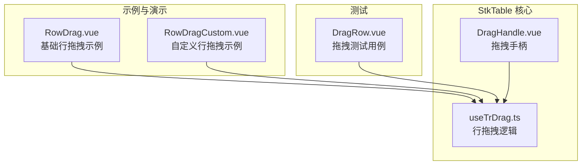
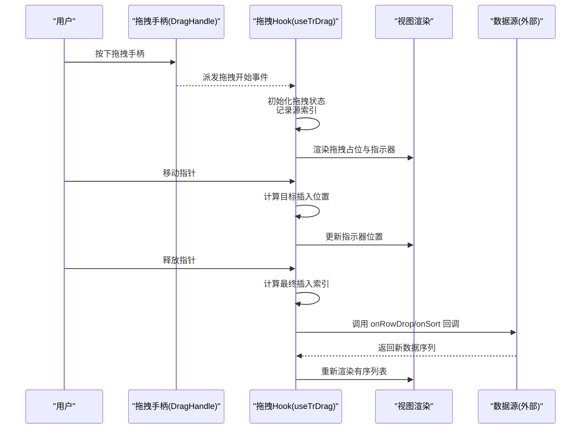
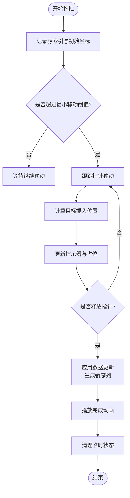
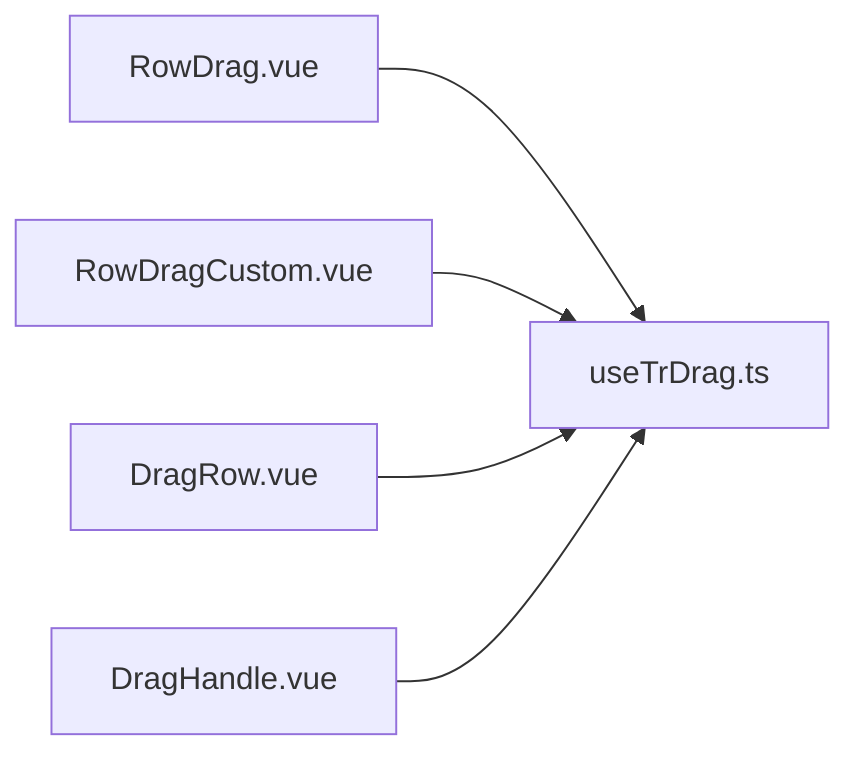

# 行拖拽

<cite>
**本文引用的文件**   
- [src/StkTable/useTrDrag.ts](file://src/StkTable/useTrDrag.ts)
- [src/StkTable/components/DragHandle.vue](file://src/StkTable/components/DragHandle.vue)
- [docs-demo/advanced/row-drag/RowDrag.vue](file://docs-demo/advanced/row-drag/RowDrag.vue)
- [docs-demo/advanced/row-drag/RowDragCustom.vue](file://docs-demo/advanced/row-drag/RowDragCustom.vue)
- [test/DragRow.vue](file://test/DragRow.vue)
</cite>

## 目录
1. [简介](#简介)
2. [项目结构](#项目结构)
3. [核心组件与能力](#核心组件与能力)
4. [架构总览](#架构总览)
5. [详细组件分析](#详细组件分析)
6. [依赖关系分析](#依赖关系分析)
7. [性能考量](#性能考量)
8. [故障排查指南](#故障排查指南)
9. [结论](#结论)
10. [附录](#附录)

## 简介
本技术文档聚焦 stk-table-vue 的行拖拽功能，系统性阐述其实现机制、事件处理流程、拖拽指示器渲染、状态管理策略、排序算法（插入位置计算与数据更新）、动画效果以及大数据量场景下的性能优化。同时给出常见应用场景（列表重排、分组操作、批量移动）与最佳实践建议，帮助开发者在复杂表格中稳定高效地使用行拖拽能力。

## 项目结构
围绕行拖拽的核心代码主要分布在以下位置：
- 行拖拽逻辑 Hook：useTrDrag.ts
- 拖拽手柄组件：DragHandle.vue
- 示例与演示：docs-demo/advanced/row-drag 下的 RowDrag.vue 与 RowDragCustom.vue
- 测试用例：test/DragRow.vue

图表来源
- [src/StkTable/useTrDrag.ts](file://src/StkTable/useTrDrag.ts)
- [src/StkTable/components/DragHandle.vue](file://src/StkTable/components/DragHandle.vue)
- [docs-demo/advanced/row-drag/RowDrag.vue](file://docs-demo/advanced/row-drag/RowDrag.vue)
- [docs-demo/advanced/row-drag/RowDragCustom.vue](file://docs-demo/advanced/row-drag/RowDragCustom.vue)
- [test/DragRow.vue](file://test/DragRow.vue)

章节来源
- [src/StkTable/useTrDrag.ts](file://src/StkTable/useTrDrag.ts)
- [src/StkTable/components/DragHandle.vue](file://src/StkTable/components/DragHandle.vue)
- [docs-demo/advanced/row-drag/RowDrag.vue](file://docs-demo/advanced/row-drag/RowDrag.vue)
- [docs-demo/advanced/row-drag/RowDragCustom.vue](file://docs-demo/advanced/row-drag/RowDragCustom.vue)
- [test/DragRow.vue](file://test/DragRow.vue)

## 核心组件与能力
- 行拖拽逻辑 Hook（useTrDrag.ts）
  - 负责监听鼠标/触摸事件，维护拖拽状态（开始、进行中、结束），计算目标插入位置，触发数据更新回调，并协调 UI 指示器与动画。
- 拖拽手柄（DragHandle.vue）
  - 提供可点击/长按的拖拽入口，屏蔽默认选择行为，避免与单元格编辑等交互冲突。
- 示例与演示
  - RowDrag.vue：展示基础行拖拽用法与最小配置。
  - RowDragCustom.vue：展示自定义拖拽区域、样式与业务扩展点。
- 测试用例
  - DragRow.vue：覆盖边界条件与异常路径，验证稳定性。

章节来源
- [src/StkTable/useTrDrag.ts](file://src/StkTable/useTrDrag.ts)
- [src/StkTable/components/DragHandle.vue](file://src/StkTable/components/DragHandle.vue)
- [docs-demo/advanced/row-drag/RowDrag.vue](file://docs-demo/advanced/row-drag/RowDrag.vue)
- [docs-demo/advanced/row-drag/RowDragCustom.vue](file://docs-demo/advanced/row-drag/RowDragCustom.vue)
- [test/DragRow.vue](file://test/DragRow.vue)

## 架构总览
行拖拽采用“事件驱动 + 状态机”的架构模式：
- 事件层：统一捕获 mousedown/mousemove/mouseup 或 touchstart/touchmove/touchend，兼容移动端。
- 状态层：维护 isDragging、dragSourceIndex、dragTargetIndex、dragGhostElement、dragIndicator 等状态。
- 计算层：根据指针坐标与 DOM 布局计算插入位置，支持虚拟滚动与固定列场景。
- 更新层：通过不可变数组操作生成新数据序列，触发父级回调以持久化变更。
- 表现层：渲染拖拽占位元素与高亮指示线，配合 CSS 过渡实现平滑动画。

图表来源
- [src/StkTable/useTrDrag.ts](file://src/StkTable/useTrDrag.ts)
- [src/StkTable/components/DragHandle.vue](file://src/StkTable/components/DragHandle.vue)

## 详细组件分析

### 拖拽事件处理与状态管理
- 事件捕获与防抖
  - 在拖拽开始时记录源行索引与初始指针位置；在移动过程中限制最小移动阈值，避免误触。
  - 对 mousemove/touchmove 进行节流或 requestAnimationFrame 合并，降低高频重绘开销。
- 状态机设计
  - 状态包括：idle、dragging、dropping。
  - 关键属性：sourceIndex、targetIndex、isDragging、ghostElement、indicatorPosition。
- 与表格其他能力的互斥
  - 与单元格编辑、列宽调整、树节点展开等交互需做事件冒泡控制与优先级判定，确保拖拽不被拦截。

章节来源
- [src/StkTable/useTrDrag.ts](file://src/StkTable/useTrDrag.ts)
- [src/StkTable/components/DragHandle.vue](file://src/StkTable/components/DragHandle.vue)

### 拖拽指示器与占位渲染
- 指示器类型
  - 顶部/底部插入线：用于明确插入位置。
  - 行高占位：使用 ghost 行保持视觉连续性。
- 渲染策略
  - 在拖拽过程中动态插入一个不可见占位行，并通过 CSS transform 或 top 偏移对齐到目标位置。
  - 指示线通过绝对定位叠加在行之间，避免影响布局流。
- 与虚拟滚动的协同
  - 仅对可视区行参与计算，非可视区行不渲染占位，减少内存占用。

章节来源
- [src/StkTable/useTrDrag.ts](file://src/StkTable/useTrDrag.ts)
- [src/StkTable/components/DragHandle.vue](file://src/StkTable/components/DragHandle.vue)

### 拖拽排序算法与数据更新策略
- 插入位置计算
  - 基于当前指针 Y 坐标与各行 bounding rect 的中线比较，确定插入区间。
  - 考虑行高不一致、合并单元格、固定列偏移等因素，必要时回退为二分查找近似位置。
- 数据更新策略
  - 使用不可变数组操作：从 sourceIndex 移除元素，再插入到 targetIndex，保证最小变更集。
  - 若启用 key 映射，优先按唯一标识重排，避免 React/Vue diff 产生不必要的重建。
- 动画效果实现
  - 使用 CSS transition 或 Web Animations API 对占位行与指示线进行平滑过渡。
  - 在 drop 完成后清理临时元素与样式，恢复原始布局。

图表来源
- [src/StkTable/useTrDrag.ts](file://src/StkTable/useTrDrag.ts)

章节来源
- [src/StkTable/useTrDrag.ts](file://src/StkTable/useTrDrag.ts)

### 示例与用法
- 基础行拖拽（RowDrag.vue）
  - 展示最小可用配置：启用拖拽、定义 onRowDrop 回调、绑定数据与列。
- 自定义行拖拽（RowDragCustom.vue）
  - 自定义拖拽区域、样式主题、禁用条件、与树/展开行的组合使用。
- 测试用例（DragRow.vue）
  - 覆盖快速拖拽、跨页拖拽、空数据、单行等边界情况。

章节来源
- [docs-demo/advanced/row-drag/RowDrag.vue](file://docs-demo/advanced/row-drag/RowDrag.vue)
- [docs-demo/advanced/row-drag/RowDragCustom.vue](file://docs-demo/advanced/row-drag/RowDragCustom.vue)
- [test/DragRow.vue](file://test/DragRow.vue)

## 依赖关系分析
- useTrDrag.ts 作为核心逻辑，被示例与测试用例直接引用。
- DragHandle.vue 作为 UI 入口，向 useTrDrag.ts 派发拖拽事件。
- 示例与测试用例通过 props/events 与 useTrDrag.ts 交互，形成松耦合。

图表来源
- [src/StkTable/useTrDrag.ts](file://src/StkTable/useTrDrag.ts)
- [src/StkTable/components/DragHandle.vue](file://src/StkTable/components/DragHandle.vue)
- [docs-demo/advanced/row-drag/RowDrag.vue](file://docs-demo/advanced/row-drag/RowDrag.vue)
- [docs-demo/advanced/row-drag/RowDragCustom.vue](file://docs-demo/advanced/row-drag/RowDragCustom.vue)
- [test/DragRow.vue](file://test/DragRow.vue)

章节来源
- [src/StkTable/useTrDrag.ts](file://src/StkTable/useTrDrag.ts)
- [src/StkTable/components/DragHandle.vue](file://src/StkTable/components/DragHandle.vue)
- [docs-demo/advanced/row-drag/RowDrag.vue](file://docs-demo/advanced/row-drag/RowDrag.vue)
- [docs-demo/advanced/row-drag/RowDragCustom.vue](file://docs-demo/advanced/row-drag/RowDragCustom.vue)
- [test/DragRow.vue](file://test/DragRow.vue)

## 性能考量
- 事件合并与节流
  - 将高频 move 事件合并至 requestAnimationFrame，避免每帧多次重排。
- 只读与不可变更新
  - 使用 splice 与 slice 生成新数组，减少深度克隆成本；仅在必要字段变化时触发重渲染。
- 虚拟滚动适配
  - 拖拽计算仅作用于可视区行；非可视区行不参与布局测量，降低 getBoundingClientRect 调用次数。
- 动画与合成层
  - 使用 transform 与 opacity 触发 GPU 加速，避免触发回流；指示线使用独立图层渲染。
- 大数据量优化
  - 分页/懒加载场景下，限制拖拽范围在当前页或可见窗口内；跨页拖拽需先加载目标页数据。
- 内存与 GC
  - 及时清理占位元素与事件监听器，防止内存泄漏；避免闭包持有大对象引用。

[本节为通用性能指导，不直接分析具体文件]

## 故障排查指南
- 拖拽无效或被拦截
  - 检查是否启用了单元格编辑、列宽调整、树节点交互；必要时在相应组件上阻止事件冒泡。
- 插入位置不准确
  - 确认行高是否一致；若存在合并单元格或固定列，需校准偏移量与中线计算。
- 动画卡顿或闪烁
  - 避免在拖拽过程中频繁修改布局属性；优先使用 transform 与 will-change。
- 数据未更新或顺序错乱
  - 校验 onRowDrop 回调是否正确返回新序列；确保 key 唯一且稳定。
- 移动端体验差
  - 增加最小移动阈值与长按延迟；区分点击与拖拽手势。

章节来源
- [src/StkTable/useTrDrag.ts](file://src/StkTable/useTrDrag.ts)
- [src/StkTable/components/DragHandle.vue](file://src/StkTable/components/DragHandle.vue)
- [test/DragRow.vue](file://test/DragRow.vue)

## 结论
stk-table-vue 的行拖拽功能通过清晰的事件驱动与状态管理机制，结合高效的插入位置计算与不可变数据更新策略，提供了稳定、流畅且可扩展的拖拽排序能力。在大数据量与复杂交互场景下，借助虚拟滚动、事件合并与 GPU 加速等手段，能够保障良好的用户体验。开发者可根据业务需求灵活定制拖拽区域、样式与行为，满足列表重排、分组操作、批量移动等多种场景。

[本节为总结性内容，不直接分析具体文件]

## 附录
- 常见应用场景
  - 列表重排：通过拖拽调整数据顺序，适用于任务清单、优先级排序等。
  - 分组操作：将某行拖拽至分组头部或尾部，实现自动归类。
  - 批量移动：结合多选与拖拽，将多行一次性移动到目标位置。
- 最佳实践
  - 始终提供明确的拖拽手柄与视觉反馈。
  - 在 onRowDrop 中进行数据校验与幂等处理。
  - 对长列表启用虚拟滚动与分页，限制拖拽范围。
  - 在移动端优化手势识别与动画性能。

[本节为概念性内容，不直接分析具体文件]