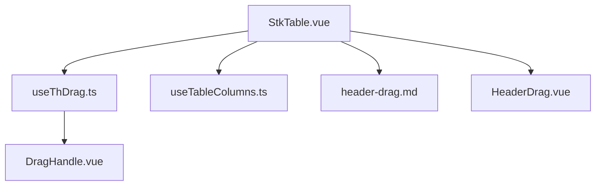
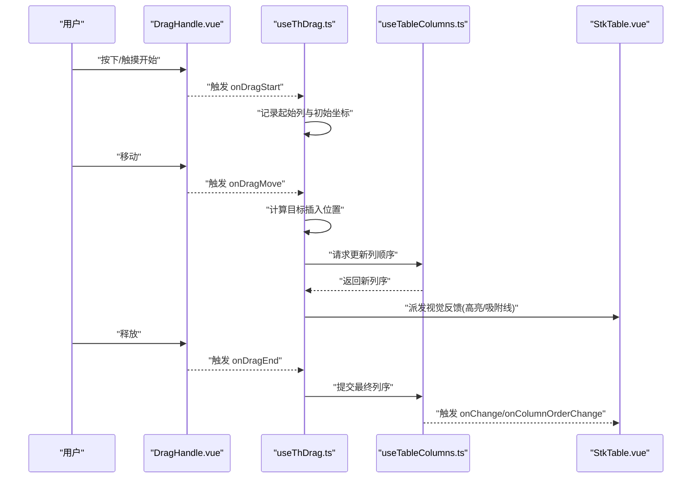
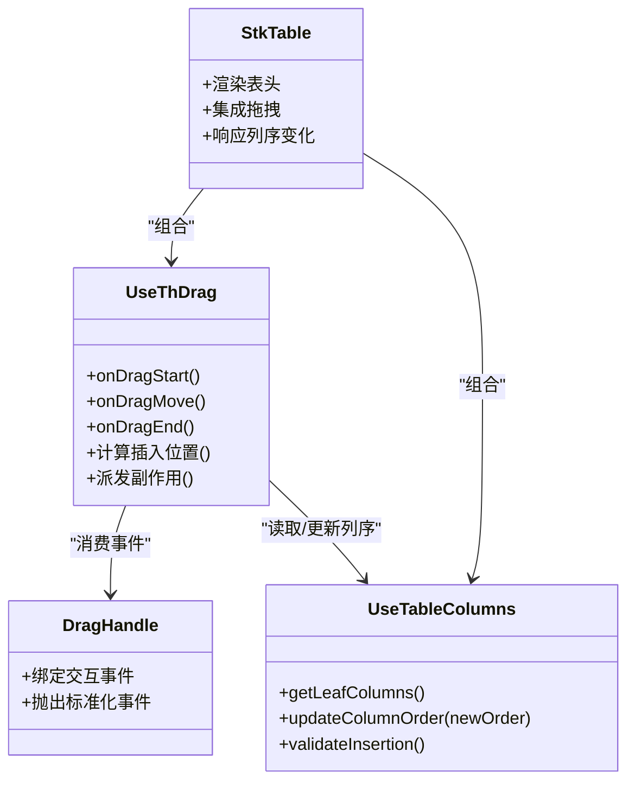
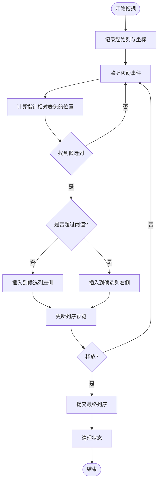

# 表头拖拽

<cite>
**本文引用的文件**   
- [src/StkTable/useThDrag.ts](file://src/StkTable/useThDrag.ts)
- [src/StkTable/components/DragHandle.vue](file://src/StkTable/components/DragHandle.vue)
- [src/StkTable/useTableColumns.ts](file://src/StkTable/useTableColumns.ts)
- [src/StkTable/StkTable.vue](file://src/StkTable/StkTable.vue)
- [docs-demo/advanced/header-drag/HeaderDrag.vue](file://docs-demo/advanced/header-drag/HeaderDrag.vue)
- [docs-src/main/table/advanced/header-drag.md](file://docs-src/main/table/advanced/header-drag.md)
</cite>

## 目录
1. [简介](#简介)
2. [项目结构](#项目结构)
3. [核心组件](#核心组件)
4. [架构总览](#架构总览)
5. [详细组件分析](#详细组件分析)
6. [依赖关系分析](#依赖关系分析)
7. [性能考量](#性能考量)
8. [故障排查指南](#故障排查指南)
9. [结论](#结论)
10. [附录](#附录)

## 简介
本技术文档聚焦 stk-table-vue 的“表头拖拽”能力，系统性阐述其实现机制与使用方式。内容涵盖：
- 拖拽事件处理流程（鼠标/触摸、移动、结束）
- 列顺序调整算法（插入位置计算、索引更新策略、冲突处理）
- 拖拽视觉反馈（占位符、高亮、吸附线等）
- 与固定列/冻结列的兼容性方案
- 典型使用场景（自定义列顺序、动态列管理、受控与非受控模式）

## 项目结构
与表头拖拽相关的代码主要分布在以下位置：
- 拖拽逻辑 Hook：useThDrag.ts
- 拖拽手柄组件：DragHandle.vue
- 列配置与状态管理：useTableColumns.ts
- 表格主组件集成入口：StkTable.vue
- 示例与文档：HeaderDrag.vue、header-drag.md

图表来源
- [src/StkTable/StkTable.vue](file://src/StkTable/StkTable.vue)
- [src/StkTable/useThDrag.ts](file://src/StkTable/useThDrag.ts)
- [src/StkTable/useTableColumns.ts](file://src/StkTable/useTableColumns.ts)
- [src/StkTable/components/DragHandle.vue](file://src/StkTable/components/DragHandle.vue)
- [docs-src/main/table/advanced/header-drag.md](file://docs-src/main/table/advanced/header-drag.md)
- [docs-demo/advanced/header-drag/HeaderDrag.vue](file://docs-demo/advanced/header-drag/HeaderDrag.vue)

章节来源
- [src/StkTable/useThDrag.ts](file://src/StkTable/useThDrag.ts)
- [src/StkTable/components/DragHandle.vue](file://src/StkTable/components/DragHandle.vue)
- [src/StkTable/useTableColumns.ts](file://src/StkTable/useTableColumns.ts)
- [src/StkTable/StkTable.vue](file://src/StkTable/StkTable.vue)
- [docs-demo/advanced/header-drag/HeaderDrag.vue](file://docs-demo/advanced/header-drag/HeaderDrag.vue)
- [docs-src/main/table/advanced/header-drag.md](file://docs-src/main/table/advanced/header-drag.md)

## 核心组件
- useThDrag.ts：封装表头拖拽的核心逻辑，包括事件监听、拖拽状态管理、目标列定位、列顺序变更与副作用派发。
- DragHandle.vue：渲染在表头单元格内的拖拽手柄，负责捕获用户交互并向上抛出拖拽事件。
- useTableColumns.ts：维护列定义与顺序，提供列顺序更新接口，供拖拽逻辑调用。
- StkTable.vue：组合各功能模块，将拖拽能力注入到表头渲染管线中。

章节来源
- [src/StkTable/useThDrag.ts](file://src/StkTable/useThDrag.ts)
- [src/StkTable/components/DragHandle.vue](file://src/StkTable/components/DragHandle.vue)
- [src/StkTable/useTableColumns.ts](file://src/StkTable/useTableColumns.ts)
- [src/StkTable/StkTable.vue](file://src/StkTable/StkTable.vue)

## 架构总览
表头拖拽的整体交互流程如下：
- 用户在 DragHandle 上按下鼠标/触摸，触发开始拖拽
- 全局监听移动事件，计算当前指针位置与候选列的几何关系，确定插入位置
- 根据插入位置更新列顺序，并同步渲染视觉反馈（如吸附线或高亮）
- 拖拽结束时提交最终顺序，触发回调或更新外部状态

图表来源
- [src/StkTable/components/DragHandle.vue](file://src/StkTable/components/DragHandle.vue)
- [src/StkTable/useThDrag.ts](file://src/StkTable/useThDrag.ts)
- [src/StkTable/useTableColumns.ts](file://src/StkTable/useTableColumns.ts)
- [src/StkTable/StkTable.vue](file://src/StkTable/StkTable.vue)

## 详细组件分析

### 拖拽事件处理（useThDrag.ts）
- 事件生命周期
  - 开始：记录被拖拽列的原始索引、初始坐标，进入拖拽态
  - 移动：基于指针坐标与表头布局，计算候选列与插入位置；避免与固定列冲突
  - 结束：提交最终顺序，清理临时状态，触发回调
- 插入位置计算
  - 以候选列中心为基准，结合水平偏移阈值判定插入到左侧或右侧
  - 考虑多级表头时，仅对叶子列生效，非叶子列不可作为目标
- 冲突处理
  - 固定列区域不参与重排，拖拽目标限制在非固定列区间
  - 若目标列与源列为同一区域且相邻，需防止原地无效重排
- 副作用派发
  - 拖拽过程中可派发中间态（用于预览），结束时派发最终态
  - 支持受控与非受控两种模式：受控模式下由外部 state 驱动，非受控模式内部维护

章节来源
- [src/StkTable/useThDrag.ts](file://src/StkTable/useThDrag.ts)

### 拖拽手柄（DragHandle.vue）
- 职责
  - 渲染拖拽图标与样式
  - 绑定 mousedown/touchstart/mousemove/mouseup 等事件
  - 向父级 Hook 抛出标准化事件对象（包含列标识、坐标信息）
- 兼容性与无障碍
  - 支持键盘操作（可选）与屏幕阅读器提示
  - 在不同浏览器下统一事件行为

章节来源
- [src/StkTable/components/DragHandle.vue](file://src/StkTable/components/DragHandle.vue)

### 列顺序管理（useTableColumns.ts）
- 数据结构
  - 维护列数组与层级关系，支持嵌套与多级表头
  - 提供按 key 查找列、获取叶子列列表等方法
- 更新策略
  - 基于插入位置进行数组重排，保持稳定性（相同 key 的顺序不变）
  - 对固定列与非固定列分区处理，确保固定列位置不受影响
- 校验与回滚
  - 对非法插入位置进行边界检查
  - 发生异常时回滚至上一有效状态

章节来源
- [src/StkTable/useTableColumns.ts](file://src/StkTable/useTableColumns.ts)

### 表格集成（StkTable.vue）
- 将 useThDrag 与列渲染管线集成，使表头单元格具备拖拽能力
- 在渲染阶段注入 DragHandle 组件到指定列
- 响应列顺序变化，重新计算布局与滚动条状态

章节来源
- [src/StkTable/StkTable.vue](file://src/StkTable/StkTable.vue)

### 使用示例与文档
- 示例组件 HeaderDrag.vue：展示如何启用表头拖拽、监听回调、与外部状态联动
- 文档 header-drag.md：说明 API、属性、事件与最佳实践

章节来源
- [docs-demo/advanced/header-drag/HeaderDrag.vue](file://docs-demo/advanced/header-drag/HeaderDrag.vue)
- [docs-src/main/table/advanced/header-drag.md](file://docs-src/main/table/advanced/header-drag.md)

## 依赖关系分析
- useThDrag.ts 依赖 DragHandle.vue 的事件输出，依赖 useTableColumns.ts 的列数据与更新方法
- StkTable.vue 聚合 useThDrag 与 useTableColumns，协调渲染与状态同步
- 示例与文档位于 docs-demo 与 docs-src，便于学习与参考

图表来源
- [src/StkTable/StkTable.vue](file://src/StkTable/StkTable.vue)
- [src/StkTable/useThDrag.ts](file://src/StkTable/useThDrag.ts)
- [src/StkTable/components/DragHandle.vue](file://src/StkTable/components/DragHandle.vue)
- [src/StkTable/useTableColumns.ts](file://src/StkTable/useTableColumns.ts)

## 性能考量
- 事件节流与防抖：在高频移动事件中合并计算，减少重排与重绘
- 局部更新：仅更新受影响列的 DOM，避免全量重渲染
- 虚拟滚动兼容：在虚拟滚动场景下，优先基于可见区域计算插入位置，降低开销
- 固定列优化：固定列不参与重排计算，缩小计算范围

[本节为通用指导，不直接分析具体文件]

## 故障排查指南
- 拖拽无响应
  - 检查 DragHandle 是否正确挂载到目标列
  - 确认事件绑定未被其他组件拦截
- 插入位置异常
  - 核对多级表头的叶子列过滤逻辑
  - 检查固定列区域的边界判断
- 列序未更新
  - 确认受控模式下外部 state 是否更新
  - 检查 updateColumnOrder 返回值与副作用派发
- 视觉反馈错位
  - 验证布局测量时机（DOM 更新后）
  - 检查滚动容器与视口尺寸变化

章节来源
- [src/StkTable/useThDrag.ts](file://src/StkTable/useThDrag.ts)
- [src/StkTable/components/DragHandle.vue](file://src/StkTable/components/DragHandle.vue)
- [src/StkTable/useTableColumns.ts](file://src/StkTable/useTableColumns.ts)

## 结论
stk-table-vue 的表头拖拽通过清晰的模块化设计实现了稳定、可扩展的交互体验。useThDrag 负责事件与算法，DragHandle 专注交互输入，useTableColumns 保障列数据的正确性，StkTable 完成整体集成。配合固定列兼容、虚拟滚动优化与受控/非受控模式，能够满足多种业务场景需求。

[本节为总结性内容，不直接分析具体文件]

## 附录

### 拖拽算法流程图（插入位置计算）

图表来源
- [src/StkTable/useThDrag.ts](file://src/StkTable/useThDrag.ts)

### 使用场景清单
- 自定义列顺序：用户通过拖拽调整列显示顺序，保存偏好设置
- 动态列管理：结合条件渲染与拖拽，实现按需显示与排序
- 与固定列共存：左侧/右侧固定列不参与拖拽，保证关键列始终可见
- 多级表头：仅在叶子列间允许拖拽，避免破坏层级结构
- 虚拟滚动：在大数据场景下，仅对可见区域进行计算与渲染

[本节为概念性内容，不直接分析具体文件]