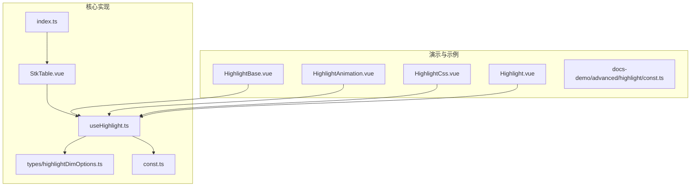
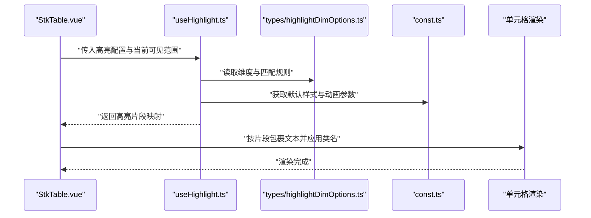
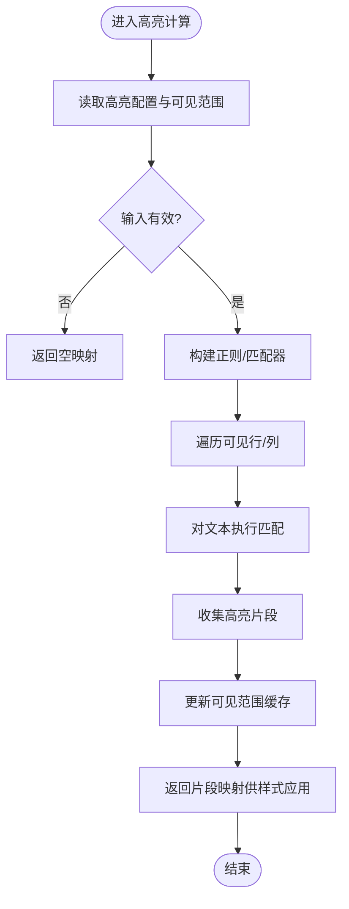
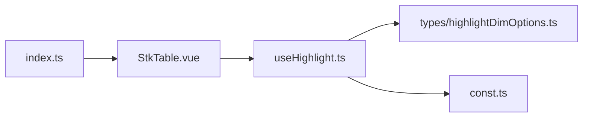

# 高亮显示

<cite>
**本文引用的文件**   
- [useHighlight.ts](file://src/StkTable/useHighlight.ts)
- [highlightDimOptions.ts](file://src/StkTable/types/highlightDimOptions.ts)
- [const.ts](file://src/StkTable/const.ts)
- [index.ts](file://src/StkTable/index.ts)
- [StkTable.vue](file://src/StkTable/StkTable.vue)
- [HighlightBase.vue](file://docs-demo/advanced/highlight/HighlightBase.vue)
- [HighlightAnimation.vue](file://docs-demo/advanced/highlight/HighlightAnimation.vue)
- [HighlightCss.vue](file://docs-demo/advanced/highlight/HighlightCss.vue)
- [Highlight.vue](file://docs-demo/advanced/highlight/Highlight.vue)
- [const.ts](file://docs-demo/advanced/highlight/const.ts)
- [virtual.md](file://docs-src/main/table/advanced/virtual.md)
- [highlight.md](file://docs-src/main/table/advanced/highlight.md)
</cite>

## 目录
1. [简介](#简介)
2. [项目结构](#项目结构)
3. [核心组件](#核心组件)
4. [架构总览](#架构总览)
5. [详细组件分析](#详细组件分析)
6. [依赖分析](#依赖分析)
7. [性能考虑](#性能考虑)
8. [故障排查指南](#故障排查指南)
9. [结论](#结论)
10. [附录](#附录)

## 简介
本技术文档围绕 stk-table-vue 的高亮显示能力，系统阐述其实现原理与使用方式。内容覆盖匹配算法、样式应用、动画效果，以及搜索高亮、条件高亮、增量高亮等典型场景；同时给出虚拟滚动下的高亮计算策略、海量数据渲染优化方案，并提供自定义高亮样式的配置方法与扩展指南。读者可据此在表格中高效、稳定地实现各类高亮需求。

## 项目结构
与高亮功能直接相关的代码位于 src/StkTable 目录，其中 useHighlight.ts 为核心逻辑钩子，types/highlightDimOptions.ts 定义高亮维度选项类型，const.ts 提供常量与默认值，StkTable.vue 作为主表组件集成高亮能力。演示与示例位于 docs-demo/advanced/highlight，涵盖基础用法、CSS 定制与动画效果。

**图表来源** 
- [useHighlight.ts](file://src/StkTable/useHighlight.ts)
- [highlightDimOptions.ts](file://src/StkTable/types/highlightDimOptions.ts)
- [const.ts](file://src/StkTable/const.ts)
- [StkTable.vue](file://src/StkTable/StkTable.vue)
- [index.ts](file://src/StkTable/index.ts)
- [HighlightBase.vue](file://docs-demo/advanced/highlight/HighlightBase.vue)
- [HighlightAnimation.vue](file://docs-demo/advanced/highlight/HighlightAnimation.vue)
- [HighlightCss.vue](file://docs-demo/advanced/highlight/HighlightCss.vue)
- [Highlight.vue](file://docs-demo/advanced/highlight/Highlight.vue)
- [const.ts](file://docs-demo/advanced/highlight/const.ts)

**章节来源**
- [useHighlight.ts](file://src/StkTable/useHighlight.ts)
- [highlightDimOptions.ts](file://src/StkTable/types/highlightDimOptions.ts)
- [const.ts](file://src/StkTable/const.ts)
- [StkTable.vue](file://src/StkTable/StkTable.vue)
- [index.ts](file://src/StkTable/index.ts)
- [HighlightBase.vue](file://docs-demo/advanced/highlight/HighlightBase.vue)
- [HighlightAnimation.vue](file://docs-demo/advanced/highlight/HighlightAnimation.vue)
- [HighlightCss.vue](file://docs-demo/advanced/highlight/HighlightCss.vue)
- [Highlight.vue](file://docs-demo/advanced/highlight/Highlight.vue)
- [const.ts](file://docs-demo/advanced/highlight/const.ts)

## 核心组件
- 高亮逻辑钩子：useHighlight.ts
  - 负责接收高亮配置（如匹配模式、范围、样式类名、动画开关），维护当前高亮状态，并在数据变化或滚动时计算可见区域的高亮结果。
  - 对外暴露用于单元格渲染的辅助方法，返回包含高亮片段信息的数据结构，供模板层包裹文本节点并应用样式。
- 高亮维度选项类型：types/highlightDimOptions.ts
  - 定义高亮作用维度（行级、列级、单元格级）、匹配字段、正则表达式、大小写敏感、多词匹配策略等。
- 常量与默认值：const.ts
  - 提供默认高亮样式类名、动画时长、防抖阈值等常量，便于统一风格与性能调优。
- 主表集成：StkTable.vue
  - 在渲染流程中调用 useHighlight，将高亮结果注入到单元格渲染管线，确保虚拟滚动下的正确性与性能。
- 导出入口：index.ts
  - 将高亮相关 API 暴露给外部使用，包括配置项类型与工具函数。

**章节来源**
- [useHighlight.ts](file://src/StkTable/useHighlight.ts)
- [highlightDimOptions.ts](file://src/StkTable/types/highlightDimOptions.ts)
- [const.ts](file://src/StkTable/const.ts)
- [StkTable.vue](file://src/StkTable/StkTable.vue)
- [index.ts](file://src/StkTable/index.ts)

## 架构总览
下图展示高亮功能在主表渲染流程中的位置与交互关系：StkTable.vue 在每行/每单元格的渲染阶段调用 useHighlight，根据当前可见索引范围与高亮配置生成高亮片段，再由模板层应用 CSS 类名与动画。

**图表来源** 
- [StkTable.vue](file://src/StkTable/StkTable.vue)
- [useHighlight.ts](file://src/StkTable/useHighlight.ts)
- [highlightDimOptions.ts](file://src/StkTable/types/highlightDimOptions.ts)
- [const.ts](file://src/StkTable/const.ts)

## 详细组件分析

### 高亮逻辑钩子 useHighlight.ts
- 职责
  - 解析高亮配置（匹配字段、正则、大小写、多词策略）。
  - 基于当前可见行/列索引范围，仅对可视数据进行匹配，避免全量计算。
  - 输出结构化的高亮片段（起始偏移、结束偏移、匹配文本），供模板层插入标记节点。
  - 支持增量更新：当输入关键词或过滤条件变化时，仅重算受影响的数据片段。
- 关键数据结构
  - 高亮片段：记录每个匹配区间的起止位置与样式类名。
  - 可见范围缓存：结合虚拟滚动，缓存已计算的片段，减少重复计算。
- 复杂度与优化
  - 时间复杂度：O(N×M)，N 为可见行数，M 为每行文本长度；通过只处理可见区域与增量更新降低常数因子。
  - 空间复杂度：O(K)，K 为可见区域内匹配片段数量。
- 错误处理
  - 对无效正则表达式进行捕获与降级（回退为普通字符串匹配）。
  - 对空数据或不可见区域返回空映射，避免无意义计算。

**图表来源** 
- [useHighlight.ts](file://src/StkTable/useHighlight.ts)

**章节来源**
- [useHighlight.ts](file://src/StkTable/useHighlight.ts)

### 高亮维度选项 types/highlightDimOptions.ts
- 维度类型
  - 行级高亮：整行背景或边框高亮。
  - 列级高亮：指定列整体高亮。
  - 单元格级高亮：精确到单元格内文本片段。
- 匹配规则
  - 字段选择：支持单字段或多字段组合匹配。
  - 匹配模式：支持正则表达式与关键字列表。
  - 大小写敏感：可配置是否忽略大小写。
  - 多词策略：支持“全部匹配”或“任一匹配”。
- 样式与动画
  - 类名前缀：便于主题化与覆盖。
  - 动画开关：控制高亮出现时的过渡效果。

**章节来源**
- [highlightDimOptions.ts](file://src/StkTable/types/highlightDimOptions.ts)

### 常量与默认值 const.ts
- 默认样式类名：如 highlight-bg、highlight-text、highlight-border。
- 动画参数：过渡时长、缓动函数。
- 性能阈值：防抖延迟、最大可见行数限制。

**章节来源**
- [const.ts](file://src/StkTable/const.ts)

### 主表集成 StkTable.vue
- 集成点
  - 在每行渲染前调用 useHighlight，传入当前行索引与可见范围。
  - 将高亮片段映射注入到单元格渲染函数，由模板层包裹匹配文本。
- 虚拟滚动适配
  - 仅对 visibleStart 到 visibleEnd 范围内的行执行高亮计算。
  - 滚动事件触发时更新可见范围，并增量刷新高亮片段。

**章节来源**
- [StkTable.vue](file://src/StkTable/StkTable.vue)

### 演示与示例
- HighlightBase.vue：基础高亮用法，展示搜索关键词与匹配结果。
- HighlightAnimation.vue：启用高亮动画，演示淡入/脉冲效果。
- HighlightCss.vue：通过 CSS 变量与类名覆盖默认样式。
- Highlight.vue：综合示例，结合多字段匹配与条件高亮。
- docs-demo/advanced/highlight/const.ts：演示用常量与样式配置。

**章节来源**
- [HighlightBase.vue](file://docs-demo/advanced/highlight/HighlightBase.vue)
- [HighlightAnimation.vue](file://docs-demo/advanced/highlight/HighlightAnimation.vue)
- [HighlightCss.vue](file://docs-demo/advanced/highlight/HighlightCss.vue)
- [Highlight.vue](file://docs-demo/advanced/highlight/Highlight.vue)
- [const.ts](file://docs-demo/advanced/highlight/const.ts)

## 依赖分析
- 内部依赖
  - useHighlight.ts 依赖 types/highlightDimOptions.ts 与 const.ts。
  - StkTable.vue 依赖 useHighlight.ts 以集成高亮能力。
  - index.ts 导出高亮相关 API，供外部模块引用。
- 外部依赖
  - Vue 响应式系统：用于高亮状态与可见范围的响应式更新。
  - CSS 引擎：通过类名与动画属性实现视觉高亮。

**图表来源** 
- [StkTable.vue](file://src/StkTable/StkTable.vue)
- [useHighlight.ts](file://src/StkTable/useHighlight.ts)
- [highlightDimOptions.ts](file://src/StkTable/types/highlightDimOptions.ts)
- [const.ts](file://src/StkTable/const.ts)
- [index.ts](file://src/StkTable/index.ts)

**章节来源**
- [StkTable.vue](file://src/StkTable/StkTable.vue)
- [useHighlight.ts](file://src/StkTable/useHighlight.ts)
- [highlightDimOptions.ts](file://src/StkTable/types/highlightDimOptions.ts)
- [const.ts](file://src/StkTable/const.ts)
- [index.ts](file://src/StkTable/index.ts)

## 性能考虑
- 虚拟滚动下的高亮计算
  - 仅对可见区域执行匹配，避免全量数据扫描。
  - 使用可见范围缓存，滚动时增量更新受影响的片段。
- 大量数据渲染优化
  - 防抖输入：对搜索关键词变更设置合理延迟，减少频繁重算。
  - 正则预编译：对固定模式提前编译，避免重复开销。
  - 文本分片：长文本按段落或单词分片匹配，降低单次计算压力。
- 动画与样式
  - 动画仅在首次匹配或关键词变化时触发，避免持续重排。
  - 使用 CSS 变量集中管理样式，便于主题切换与覆盖。

[本节为通用性能建议，不直接分析具体文件]

## 故障排查指南
- 常见问题
  - 高亮未生效：检查可见范围是否正确传递，确认模板层是否包裹了匹配文本。
  - 正则报错：验证正则表达式语法，必要时降级为字符串匹配。
  - 动画卡顿：关闭动画或缩短过渡时长，减少重绘次数。
- 调试技巧
  - 打印可见范围与匹配片段，确认计算逻辑是否符合预期。
  - 使用浏览器开发者工具的 Performance 面板定位瓶颈。

**章节来源**
- [useHighlight.ts](file://src/StkTable/useHighlight.ts)

## 结论
stk-table-vue 的高亮显示功能通过 useHighlight.ts 钩子实现了高效、可扩展的匹配与渲染机制。结合虚拟滚动与增量更新，能够在大数据量场景下保持良好性能。通过灵活的维度选项与样式配置，用户可轻松实现搜索高亮、条件高亮与动画效果。建议在实际项目中结合业务需求调整匹配策略与性能阈值，以获得最佳用户体验。

[本节为总结性内容，不直接分析具体文件]

## 附录
- 参考文档
  - [虚拟滚动文档](file://docs-src/main/table/advanced/virtual.md)
  - [高亮功能文档](file://docs-src/main/table/advanced/highlight.md)

**章节来源**
- [virtual.md](file://docs-src/main/table/advanced/virtual.md)
- [highlight.md](file://docs-src/main/table/advanced/highlight.md)