# 高级功能

<cite>
**本文引用的文件**   
- [StkTable.vue](file://src/StkTable/StkTable.vue)
- [useVirtualScroll.ts](file://src/StkTable/useVirtualScroll.ts)
- [useTree.ts](file://src/StkTable/useTree.ts)
- [useSorter.ts](file://src/StkTable/useSorter.ts)
- [useAreaSelection.ts](file://src/StkTable/features/useAreaSelection.ts)
- [useColResize.ts](file://src/StkTable/useColResize.ts)
- [useTrDrag.ts](file://src/StkTable/useTrDrag.ts)
- [EditableCell/index.vue](file://src/StkTable/custom-cells/EditableCell/index.vue)
- [FilterCell/index.vue](file://src/StkTable/custom-cells/FilterCell/index.vue)
- [CheckboxCell/index.vue](file://src/StkTable/custom-cells/CheckboxCell/index.vue)
- [ChangeCell/index.ts](file://src/StkTable/custom-cells/ChangeCell/index.ts)
- [NumberCell/index.ts](file://src/StkTable/custom-cells/NumberCell/index.ts)
- [TreeNodeCell.vue](file://src/StkTable/components/TreeNodeCell.vue)
- [const.ts](file://src/StkTable/const.ts)
- [index.ts](file://src/StkTable/index.ts)
- [registerFeature.ts](file://src/StkTable/registerFeature.ts)
- [features/index.ts](file://src/StkTable/features/index.ts)
- [AutoHeightVirtual/index.vue](file://docs-demo/advanced/auto-height-virtual/AutoHeightVirtual/index.vue)
- [PretextAutoHeight/index.vue](file://docs-demo/advanced/auto-height-virtual/PretextAutoHeight/index.vue)
- [VirtualX.vue](file://docs-demo/advanced/virtual/VirtualX.vue)
- [VirtualY.vue](file://docs-demo/advanced/virtual/VirtualY.vue)
- [AreaSelection.vue](file://docs-demo/advanced/area-selection/AreaSelection.vue)
- [ColResizable.vue](file://docs-demo/advanced/column-resize/ColResizable.vue)
- [RowDrag.vue](file://docs-demo/advanced/row-drag/RowDrag.vue)
- [CustomSort/index.vue](file://docs-demo/advanced/custom-sort/CustomSort/index.vue)
- [InsertSort.vue](file://docs-demo/advanced/custom-sort/InsertSort.vue)
- [HeaderDrag.vue](file://docs-demo/advanced/header-drag/HeaderDrag.vue)
- [Highlight.vue](file://docs-demo/advanced/highlight/Highlight.vue)
- [HugeData/index.vue](file://docs-demo/demos/HugeData/index.vue)
- [HugeData/mockData.ts](file://docs-demo/demos/HugeData/mockData.ts)
- [HugeData/event.ts](file://docs-demo/demos/HugeData/event.ts)
- [HugeData/columns.ts](file://docs-demo/demos/HugeData/columns.ts)
- [VirtualList/index.vue](file://docs-demo/demos/VirtualList/index.vue)
- [Panel.vue](file://docs-demo/demos/VirtualList/Panel.vue)
- [types.ts](file://docs-demo/demos/VirtualList/types.ts)
</cite>

## 目录
1. [简介](#简介)
2. [项目结构](#项目结构)
3. [核心组件](#核心组件)
4. [架构总览](#架构总览)
5. [详细组件分析](#详细组件分析)
6. [依赖关系分析](#依赖关系分析)
7. [性能考量](#性能考量)
8. [故障排查指南](#故障排查指南)
9. [结论](#结论)
10. [附录](#附录)

## 简介
本章节聚焦 stk-table-vue 的高级能力，围绕虚拟滚动、树形数据、自定义排序、区域选择、列宽调整、行拖拽与单元格编辑等特性展开。文档面向有经验的开发者，提供实现原理、数据结构与算法、交互流程、性能优化策略与内存管理建议，并给出复杂场景下的最佳实践与常见问题解决方案。

## 项目结构
stk-table-vue 采用“主表 + 可插拔特性”的架构：
- 主入口与渲染：StkTable.vue 负责表格整体布局、事件分发与子模块协调。
- 特性钩子：以 use* 组合式函数形式提供能力（如虚拟滚动、树、排序、拖拽、列宽调整等）。
- 自定义单元格：通过 custom-cells 目录提供可复用单元格类型（编辑、过滤、复选框、数值格式化等），支持扩展。
- 示例与演示：docs-demo 下包含大量高级用法示例，便于理解与集成。

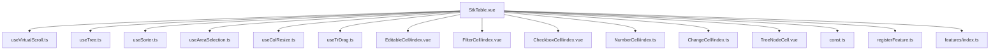

图表来源
- [StkTable.vue](file://src/StkTable/StkTable.vue)
- [useVirtualScroll.ts](file://src/StkTable/useVirtualScroll.ts)
- [useTree.ts](file://src/StkTable/useTree.ts)
- [useSorter.ts](file://src/StkTable/useSorter.ts)
- [useAreaSelection.ts](file://src/StkTable/features/useAreaSelection.ts)
- [useColResize.ts](file://src/StkTable/useColResize.ts)
- [useTrDrag.ts](file://src/StkTable/useTrDrag.ts)
- [EditableCell/index.vue](file://src/StkTable/custom-cells/EditableCell/index.vue)
- [FilterCell/index.vue](file://src/StkTable/custom-cells/FilterCell/index.vue)
- [CheckboxCell/index.vue](file://src/StkTable/custom-cells/CheckboxCell/index.vue)
- [NumberCell/index.ts](file://src/StkTable/custom-cells/NumberCell/index.ts)
- [ChangeCell/index.ts](file://src/StkTable/custom-cells/ChangeCell/index.ts)
- [TreeNodeCell.vue](file://src/StkTable/components/TreeNodeCell.vue)
- [const.ts](file://src/StkTable/const.ts)
- [registerFeature.ts](file://src/StkTable/registerFeature.ts)
- [features/index.ts](file://src/StkTable/features/index.ts)

章节来源
- [StkTable.vue](file://src/StkTable/StkTable.vue)
- [index.ts](file://src/StkTable/index.ts)

## 核心组件
- 虚拟滚动：基于可视区域计算可见索引范围，按需渲染行与列，显著降低 DOM 节点数量与重排开销。
- 树形数据：维护父子关系、展开状态与层级偏移，结合虚拟滚动实现大数据量树表的高效渲染。
- 自定义排序：支持多列排序、稳定排序与自定义比较器，适配远程排序与本地排序两种模式。
- 区域选择：鼠标/键盘驱动的区域选择，支持跨页选择与增量更新。
- 列宽调整：拖拽列头边界动态调整列宽，保持布局一致性与滚动同步。
- 行拖拽：支持行间拖拽排序与跨组拖拽，内部维护数据顺序与视图映射。
- 单元格编辑：内置可编辑单元格与过滤器，支持输入校验、失焦保存与撤销回滚。

章节来源
- [useVirtualScroll.ts](file://src/StkTable/useVirtualScroll.ts)
- [useTree.ts](file://src/StkTable/useTree.ts)
- [useSorter.ts](file://src/StkTable/useSorter.ts)
- [useAreaSelection.ts](file://src/StkTable/features/useAreaSelection.ts)
- [useColResize.ts](file://src/StkTable/useColResize.ts)
- [useTrDrag.ts](file://src/StkTable/useTrDrag.ts)
- [EditableCell/index.vue](file://src/StkTable/custom-cells/EditableCell/index.vue)
- [FilterCell/index.vue](file://src/StkTable/custom-cells/FilterCell/index.vue)
- [CheckboxCell/index.vue](file://src/StkTable/custom-cells/CheckboxCell/index.vue)
- [NumberCell/index.ts](file://src/StkTable/custom-cells/NumberCell/index.ts)
- [ChangeCell/index.ts](file://src/StkTable/custom-cells/ChangeCell/index.ts)

## 架构总览
stk-table-vue 的核心由“主表容器 + 特性插件 + 自定义单元格”构成。主表通过组合式函数暴露能力，并在渲染管线中按序执行：初始化配置 → 构建列模型 → 计算可见范围 → 渲染行/列 → 处理交互事件 → 更新状态。

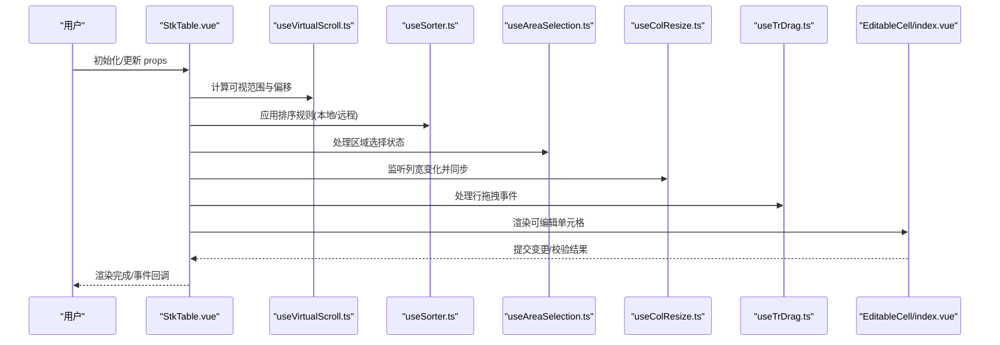

图表来源
- [StkTable.vue](file://src/StkTable/StkTable.vue)
- [useVirtualScroll.ts](file://src/StkTable/useVirtualScroll.ts)
- [useSorter.ts](file://src/StkTable/useSorter.ts)
- [useAreaSelection.ts](file://src/StkTable/features/useAreaSelection.ts)
- [useColResize.ts](file://src/StkTable/useColResize.ts)
- [useTrDrag.ts](file://src/StkTable/useTrDrag.ts)
- [EditableCell/index.vue](file://src/StkTable/custom-cells/EditableCell/index.vue)

## 详细组件分析

### 虚拟滚动实现原理
- 可视范围计算：根据容器高度、行高缓存与滚动位置，计算起始与结束索引，仅渲染可见区间内的行。
- 占位与偏移：使用绝对定位与 transform 将不可见区域占位，避免频繁重排；对固定列与冻结头部进行独立滚动同步。
- 行高自适应：支持动态行高测量与缓存，必要时触发重新计算与重绘。
- 双向虚拟：支持横向与纵向虚拟滚动，列虚拟化需配合列宽缓存与最小宽度约束。

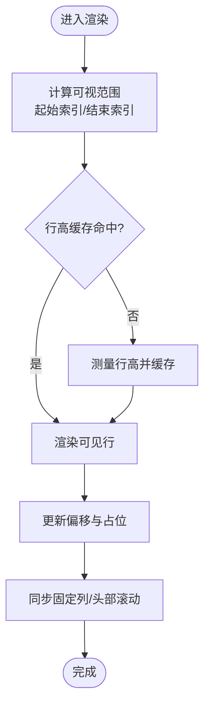

图表来源
- [useVirtualScroll.ts](file://src/StkTable/useVirtualScroll.ts)
- [AutoHeightVirtual/index.vue](file://docs-demo/advanced/auto-height-virtual/AutoHeightVirtual/index.vue)
- [PretextAutoHeight/index.vue](file://docs-demo/advanced/auto-height-virtual/PretextAutoHeight/index.vue)
- [VirtualX.vue](file://docs-demo/advanced/virtual/VirtualX.vue)
- [VirtualY.vue](file://docs-demo/advanced/virtual/VirtualY.vue)

章节来源
- [useVirtualScroll.ts](file://src/StkTable/useVirtualScroll.ts)
- [AutoHeightVirtual/index.vue](file://docs-demo/advanced/auto-height-virtual/AutoHeightVirtual/index.vue)
- [PretextAutoHeight/index.vue](file://docs-demo/advanced/auto-height-virtual/PretextAutoHeight/index.vue)
- [VirtualX.vue](file://docs-demo/advanced/virtual/VirtualX.vue)
- [VirtualY.vue](file://docs-demo/advanced/virtual/VirtualY.vue)

### 树形数据结构处理
- 数据建模：维护 id、parentId、children 字段，生成扁平化索引与层级偏移，支持懒加载子节点。
- 展开状态：使用 key 集合记录展开节点，切换时更新可见列表与虚拟滚动偏移。
- 合并与排序：在树模式下，排序与合并需考虑父子关系与层级约束，避免破坏树结构。

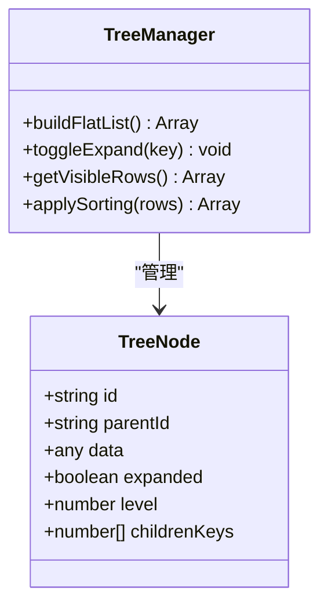

图表来源
- [useTree.ts](file://src/StkTable/useTree.ts)
- [TreeNodeCell.vue](file://src/StkTable/components/TreeNodeCell.vue)

章节来源
- [useTree.ts](file://src/StkTable/useTree.ts)
- [TreeNodeCell.vue](file://src/StkTable/components/TreeNodeCell.vue)

### 自定义排序算法
- 多列排序：维护排序键数组，按优先级依次比较，保证稳定性。
- 比较器扩展：支持字符串、数字、日期与自定义比较逻辑，兼容空值与异常值。
- 远程排序：当启用远程排序时，前端仅维护排序键，后端返回有序数据。

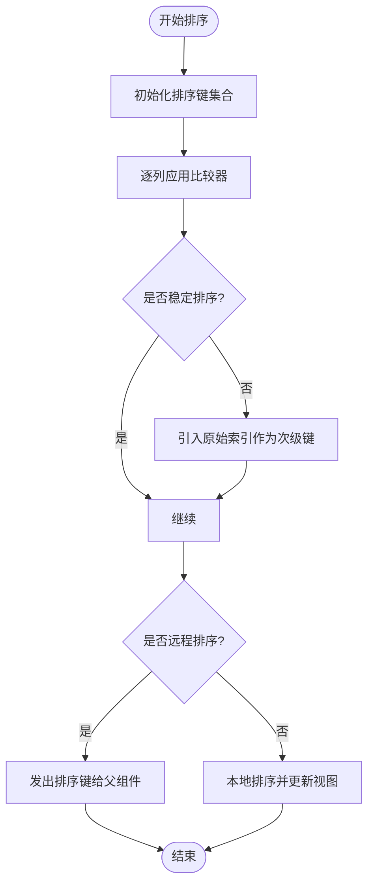

图表来源
- [useSorter.ts](file://src/StkTable/useSorter.ts)
- [CustomSort/index.vue](file://docs-demo/advanced/custom-sort/CustomSort/index.vue)
- [InsertSort.vue](file://docs-demo/advanced/custom-sort/InsertSort.vue)

章节来源
- [useSorter.ts](file://src/StkTable/useSorter.ts)
- [CustomSort/index.vue](file://docs-demo/advanced/custom-sort/CustomSort/index.vue)
- [InsertSort.vue](file://docs-demo/advanced/custom-sort/InsertSort.vue)

### 区域选择机制
- 事件驱动：mousedown/mousemove/mouseup 与键盘方向键组合，维护选择起点与终点。
- 增量更新：仅在可视范围内标记选中状态，减少响应式开销。
- 跨页选择：支持分页或虚拟滚动下的连续选择，保持选中集合一致性。

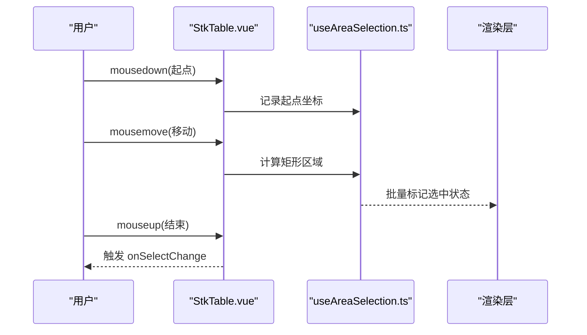

图表来源
- [useAreaSelection.ts](file://src/StkTable/features/useAreaSelection.ts)
- [AreaSelection.vue](file://docs-demo/advanced/area-selection/AreaSelection.vue)

章节来源
- [useAreaSelection.ts](file://src/StkTable/features/useAreaSelection.ts)
- [AreaSelection.vue](file://docs-demo/advanced/area-selection/AreaSelection.vue)

### 列宽调整实现
- 拖拽边界：监听 th 边界点击与拖拽，实时计算新列宽并更新列模型。
- 布局同步：调整列宽后触发重排，确保固定列与滚动条位置正确。
- 约束与回退：设置最小/最大宽度，超出范围时回退到上次有效值。

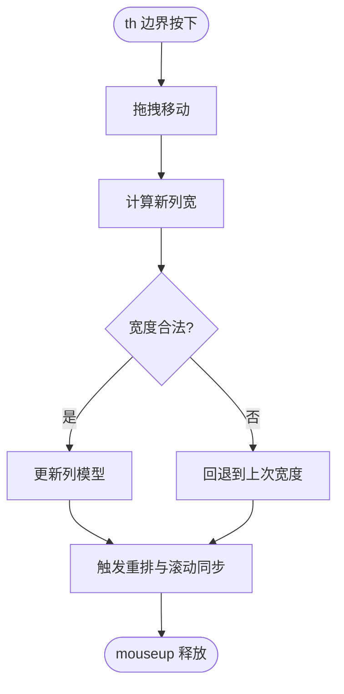

图表来源
- [useColResize.ts](file://src/StkTable/useColResize.ts)
- [ColResizable.vue](file://docs-demo/advanced/column-resize/ColResizable.vue)

章节来源
- [useColResize.ts](file://src/StkTable/useColResize.ts)
- [ColResizable.vue](file://docs-demo/advanced/column-resize/ColResizable.vue)

### 行拖拽与排序
- 拖拽手柄：在行内提供拖拽手柄，捕获 mousedown/mousemove/mouseup 事件。
- 插入位置：计算目标行索引，更新数据顺序并刷新视图。
- 动画与反馈：可选过渡动画提升用户体验，同时保持性能。

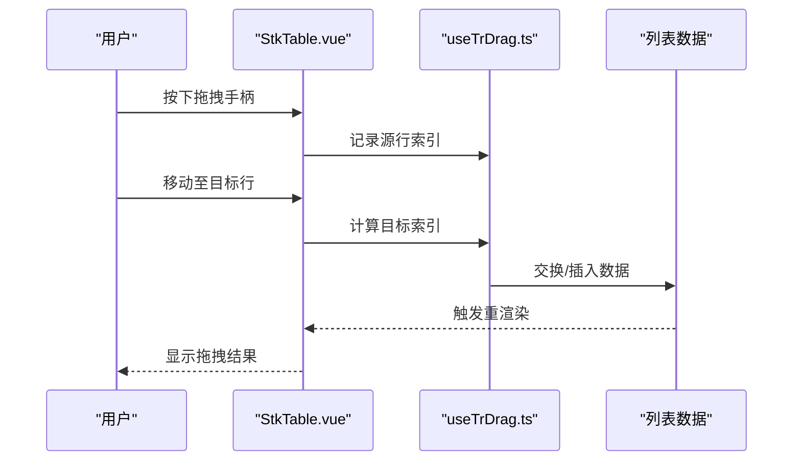

图表来源
- [useTrDrag.ts](file://src/StkTable/useTrDrag.ts)
- [RowDrag.vue](file://docs-demo/advanced/row-drag/RowDrag.vue)

章节来源
- [useTrDrag.ts](file://src/StkTable/useTrDrag.ts)
- [RowDrag.vue](file://docs-demo/advanced/row-drag/RowDrag.vue)

### 单元格编辑与过滤
- 可编辑单元格：支持输入、选择、日期等控件，失焦或回车提交，支持撤销与校验。
- 过滤器：列头下拉筛选，支持多选、范围与自定义条件，联动排序与分页。
- 数值格式化：自动对齐与千分位、小数位数控制，提升可读性。

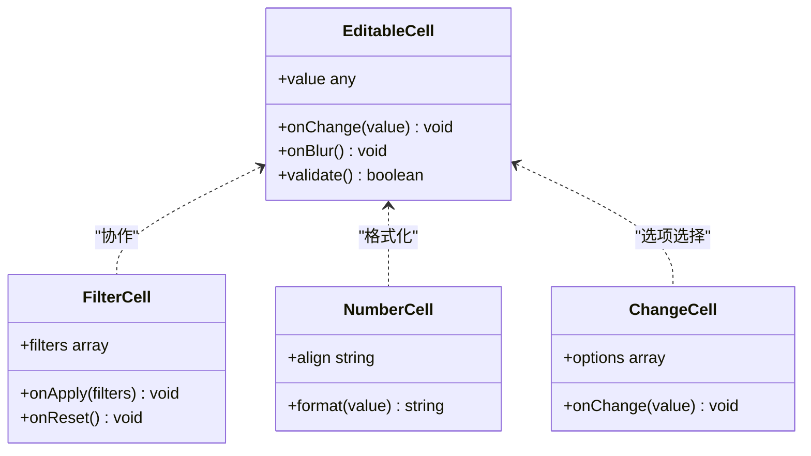

图表来源
- [EditableCell/index.vue](file://src/StkTable/custom-cells/EditableCell/index.vue)
- [FilterCell/index.vue](file://src/StkTable/custom-cells/FilterCell/index.vue)
- [NumberCell/index.ts](file://src/StkTable/custom-cells/NumberCell/index.ts)
- [ChangeCell/index.ts](file://src/StkTable/custom-cells/ChangeCell/index.ts)

章节来源
- [EditableCell/index.vue](file://src/StkTable/custom-cells/EditableCell/index.vue)
- [FilterCell/index.vue](file://src/StkTable/custom-cells/FilterCell/index.vue)
- [NumberCell/index.ts](file://src/StkTable/custom-cells/NumberCell/index.ts)
- [ChangeCell/index.ts](file://src/StkTable/custom-cells/ChangeCell/index.ts)

### 概念总览
以下流程图展示典型的大数据处理与渲染路径，帮助理解各模块协作方式。

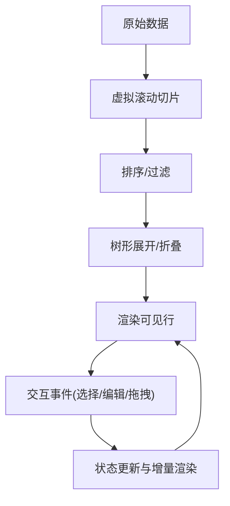

[本图为概念示意，不直接对应具体源码文件]

## 依赖关系分析
stk-table-vue 的特性通过 registerFeature 与 features/index 进行注册与装配，主表在初始化时按需加载。

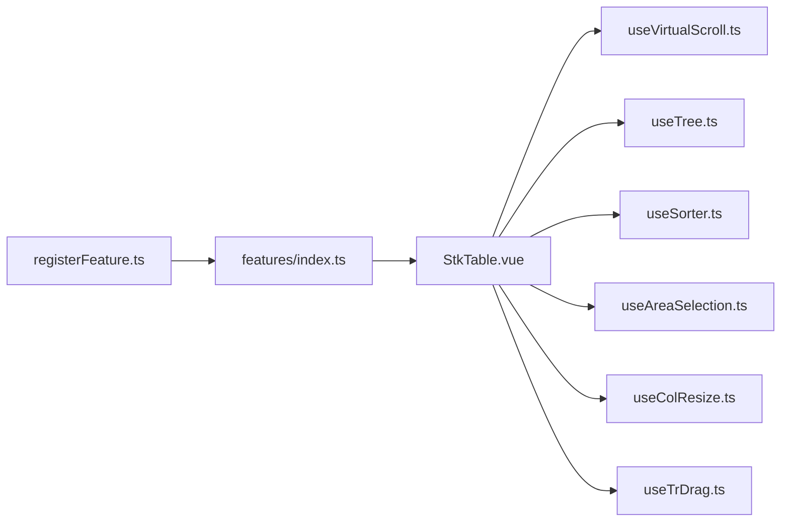

图表来源
- [registerFeature.ts](file://src/StkTable/registerFeature.ts)
- [features/index.ts](file://src/StkTable/features/index.ts)
- [StkTable.vue](file://src/StkTable/StkTable.vue)

章节来源
- [registerFeature.ts](file://src/StkTable/registerFeature.ts)
- [features/index.ts](file://src/StkTable/features/index.ts)
- [StkTable.vue](file://src/StkTable/StkTable.vue)

## 性能考量
- 虚拟滚动优先：始终启用虚拟滚动，合理设置行高缓存与最小渲染行数。
- 行高测量优化：避免频繁测量，使用 requestAnimationFrame 批处理测量与更新。
- 数据不可变性：使用不可变数据结构与浅比较，减少不必要的重渲染。
- 事件节流与防抖：滚动、拖拽与输入事件使用节流/防抖，降低主线程压力。
- 内存管理：及时清理事件监听与定时器，避免闭包引用导致泄漏。
- 大数据方案：分页+虚拟滚动、懒加载子节点、服务端排序与过滤。

[本节为通用指导，不直接分析具体文件]

## 故障排查指南
- 虚拟滚动错位：检查行高缓存是否失效，确认固定列与头部滚动同步逻辑。
- 树表展开异常：验证 id 唯一性与 parentId 关联，确保展开 key 集合正确更新。
- 排序不稳定：引入原始索引作为次级键，确保相同值的相对顺序不变。
- 区域选择闪烁：限制可视范围内更新，避免全量重渲染。
- 列宽调整抖动：设置最小/最大宽度，拖拽结束后再触发重排。
- 单元格编辑丢失焦点：在虚拟滚动中确保焦点元素与可见范围一致。

章节来源
- [useVirtualScroll.ts](file://src/StkTable/useVirtualScroll.ts)
- [useTree.ts](file://src/StkTable/useTree.ts)
- [useSorter.ts](file://src/StkTable/useSorter.ts)
- [useAreaSelection.ts](file://src/StkTable/features/useAreaSelection.ts)
- [useColResize.ts](file://src/StkTable/useColResize.ts)

## 结论
stk-table-vue 通过模块化与组合式函数设计，将虚拟滚动、树形数据、排序、区域选择、列宽调整、行拖拽与单元格编辑等高级能力解耦，既保证了高性能渲染，又提供了灵活的扩展点。在实际项目中，建议结合大数据场景选择合适的分页与懒加载策略，并通过合理的内存管理与事件优化，获得稳定的用户体验。

[本节为总结，不直接分析具体文件]

## 附录
- 示例参考：
  - 虚拟滚动与自动高度：[AutoHeightVirtual/index.vue](file://docs-demo/advanced/auto-height-virtual/AutoHeightVirtual/index.vue)、[PretextAutoHeight/index.vue](file://docs-demo/advanced/auto-height-virtual/PretextAutoHeight/index.vue)
  - 横向/纵向虚拟：[VirtualX.vue](file://docs-demo/advanced/virtual/VirtualX.vue)、[VirtualY.vue](file://docs-demo/advanced/virtual/VirtualY.vue)
  - 区域选择：[AreaSelection.vue](file://docs-demo/advanced/area-selection/AreaSelection.vue)
  - 列宽调整：[ColResizable.vue](file://docs-demo/advanced/column-resize/ColResizable.vue)
  - 行拖拽：[RowDrag.vue](file://docs-demo/advanced/row-drag/RowDrag.vue)
  - 自定义排序：[CustomSort/index.vue](file://docs-demo/advanced/custom-sort/CustomSort/index.vue)、[InsertSort.vue](file://docs-demo/advanced/custom-sort/InsertSort.vue)
  - 大数据与虚拟列表：[HugeData/index.vue](file://docs-demo/demos/HugeData/index.vue)、[VirtualList/index.vue](file://docs-demo/demos/VirtualList/index.vue)

[本节为资源索引，不直接分析具体文件]